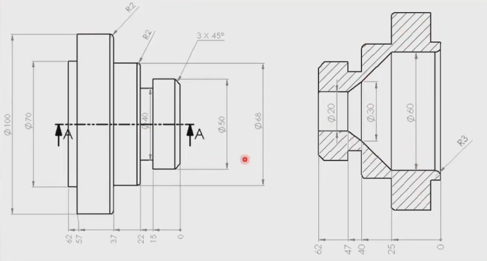
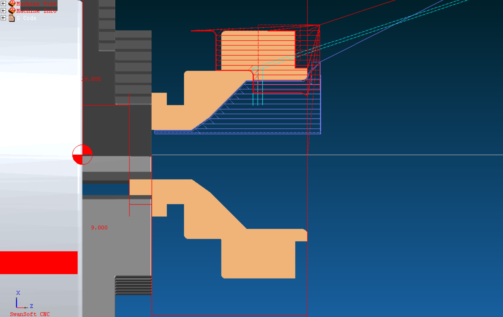
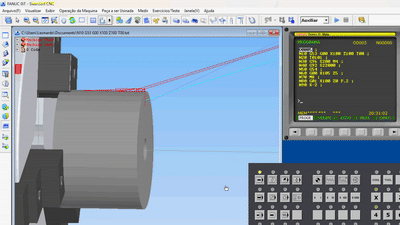
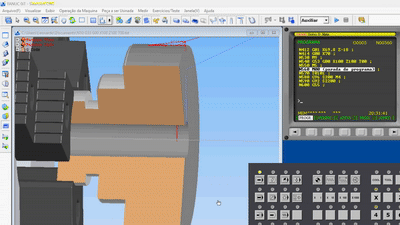

# 🛠️ Projeto CNC – Usinagem de Dois Lados com Ciclos G71, G70 e G75

**Autor:** Leonardo N. Duarte  
📧 nevesduartel@gmail.com 

---

## 🎯 Objetivo

Este projeto demonstra a usinagem completa de uma peça no **torno CNC FANUC**, com operações externas e internas, utilizando **ciclos de desbaste, acabamento e canal**.

---

## 📐 **Especificações da Peça**

* **Bruta:** 72 mm de comprimento
* **Acabada:** 62 mm de comprimento
* **Diâmetros principais:** Ø100, Ø70, Ø40, Ø20
* **Raios:** R2 e R3
* **Chanfros:** 3 × 45°

**Sistema de coordenadas:**

* **G54:** Setado 5 mm para dentro da peça para permitir faceamento (+5 mm cada lado)
* **G55:** Setado para operações internas

---

### **Desenho técnico**



---

## 🧭 **Trajetória da Ferramenta**

Inclui:

* Desbaste longitudinal externo com **G71**
* Acabamento com **G70**
* Faceamento e canal com **G75**
* Operação interna com G71 + G70
* Compensação de raio G41/G42



---

## ✅ **Estrutura do Programa CNC**

### **1. Preparação**

* `G53` → posição segura
* `G96` → velocidade de corte constante
* `G92` → limite de rotação
* `G54` → referência externa
* `G55` → referência interna

---

### **2. Desbaste Externo – G71**

```gcode
N110 G71 U2 R2
N120 G71 P130 Q210 U0.4 W0.2 F.3
N130 G01 X48 Z0
N140 X50 Z-3
N150 Z-22
N160 X64
N170 G03 X68 Z-24 R2
N180 G01 Z-37
N190 X96
N200 G03 X100 Z-39 R2
N210 G01 Z-47
```

---

### **3. Acabamento Externo – G70**

```gcode
N310 G42
N320 G70 P130 Q210 F.2
N330 G40
```

---

### **4. Canal com Bedame – G75**

```gcode
N400 G00 X70 Z-18
N410 M8
N110 G75 R1
N120 G75 X40 P2000 Q4000 F0.1
; deslocamentos para completar largura do canal
```

---

### **5. Desbaste Interno – G71**

```gcode
N660 G71 R2
N670 G71 P680 Q718 U0.4 W0.2 F.3
N680 G01 X70 Z0
N690 Z-5
N710 X100
N718 Z-15
```

---

### **6. Acabamento Interno – G70**

```gcode
N1150 G41
N1160 G70 P990 Q1048 F.1
N1170 G40
```

---

## 🔍 **Principais Códigos Utilizados**

* **G71** → Ciclo de desbaste longitudinal (eixo Z)
* **G75** → Ciclo de corte intermitente para canal
* **G70** → Ciclo de acabamento
* **G41/G42** → Compensação de raio da ferramenta
* **M00** → Parada programada
* **M9 / M8** → Controle de fluido de corte
---

## 💻 **Simulação**

Este projeto foi validado no **SwanSoft CNC** com controle **FANUC 0i-T**





---

O código G completo utilizado neste projeto está disponível neste repositório. Acesse o arquivo [usinagem-dois-lados.gcode](usinagem-dois-lados.gcode) para mais detalhes.


